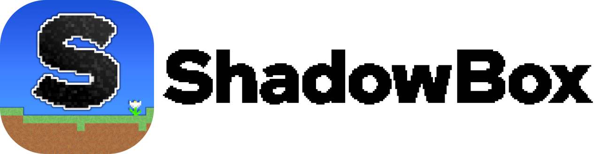

# ShadowBox

2023年学園祭に向けたプロジェクト「ShadowBox」用リポジトリ
## About

2023年の学園祭に向けて開発中のサンドボックス型ゲーム「ShadowBox」用プライベートリポジトリ。

ゲームは2Dサンドボックスゲームで、4レイヤー(ブロック+外壁のレイヤーを2セット)を持つことを特徴とする。

## ToDo

~~とりあえず年内に動くサーバー実装を完成させることを目標とする。~~
一応完成。あとはバグ取りなど。

もうちょっとコードの見栄え良くしたりサーバー単体で動かすための実装もした方が良さそう。

## All

開発で用いるUnity バージョン:2020.3.8f1

開発で用いたVisual Studio バージョン: 2019

## Server

「ゲームのデータ管理」を担い、内部通信を汎用的なものにすることでマルチ/シングルの双方に対応させる。(マイクラみたいな)

実装はC#、根本的な通信を担うのはUnity Transport。
